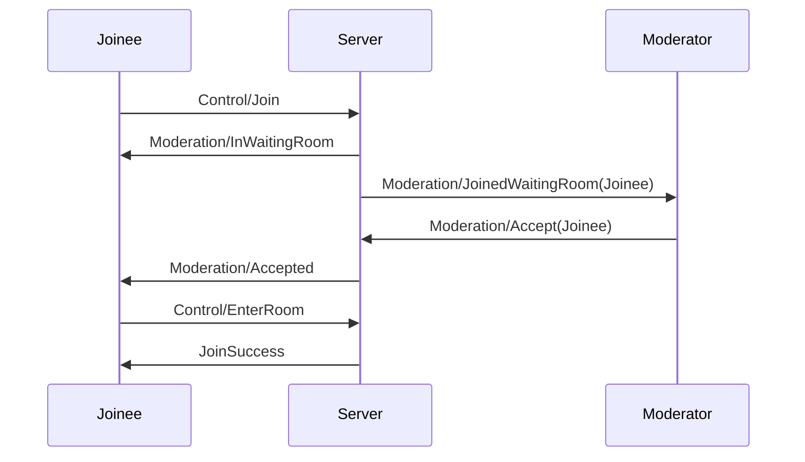

# Moderation

Module which contains logic to handle moderation based features.

Flow for joining a room with the waiting-room enabled:



## Commands

### Kick

Requires moderator role.

Remove a participant from the room.

#### Fields

| Field    | Type     | Required | Description                   |
| -------- | -------- | -------- | ----------------------------- |
| `action` | `enum`   | yes      | Must be `"kick"`              |
| `target` | `string` | yes      | Id of the participant to kick |

##### Example

```json
{
    "action": "kick",
    "target": "00000000-0000-0000-0000-000000000000"
}
```

---

### Ban

Requires moderator role.

Ban a user from the room. Can only be used on participants where `participation_kind` is "user". The user's user-id will
be banned from the room for the remainder of the session.

#### Fields

| Field    | Type     | Required | Description                  |
| -------- | -------- | -------- | ---------------------------- |
| `action` | `enum`   | yes      | Must be `"ban"`              |
| `target` | `string` | yes      | Id of the participant to ban |

##### Example

```json
{
    "action": "ban",
    "target": "00000000-0000-0000-0000-000000000000"
}
```

---

### EnableWaitingRoom

Requires moderator role.

Enable the waiting room.

#### Fields

| Field    | Type   | Required | Description                     |
| -------- | ------ | -------- | ------------------------------- |
| `action` | `enum` | yes      | Must be `"enable_waiting_room"` |

##### Example

```json
{
    "action": "enable_waiting_room"
}

```

---

### DisableWaitingRoom

Requires moderator role.

Disable the waiting room.

__NOTE:__ Participants inside the waiting room will not be automatically accepted.

#### Fields

| Field    | Type   | Required | Description                      |
| -------- | ------ | -------- | -------------------------------- |
| `action` | `enum` | yes      | Must be `"disable_waiting_room"` |

##### Example

```json
{
    "action": "disable_waiting_room"
}

```

---

### EnableRaisedHands

Requires moderator role.

Enable raising of hands by participants in the room.

#### Fields

| Field    | Type   | Required | Description                    |
| -------- | ------ | -------- | ------------------------------ |
| `action` | `enum` | yes      | Must be `"enable_raise_hands"` |

##### Example

```json
{
    "action": "enable_raise_hands"
}

```

---

### DisableRaiseHands

Requires moderator role.

Disable raising of hands by participants in the room.

__NOTE:__ Raised hands by participants will be lowered when this command is
triggered.

#### Fields

| Field    | Type   | Required | Description                     |
| -------- | ------ | -------- | ------------------------------- |
| `action` | `enum` | yes      | Must be `"disable_raise_hands"` |

##### Example

```json
{
    "action": "disable_raise_hands"
}

```

---

### Accept

Requires moderator role.

Accept a participant inside the waiting into the room.

#### Fields

| Field    | Type     | Required | Description                     |
| -------- | -------- | -------- | ------------------------------- |
| `action` | `enum`   | yes      | Must be `"accept"`              |
| `target` | `string` | yes      | Id of the participant to accept |

##### Example

```json
{
    "action": "accept",
    "target": "00000000-0000-0000-0000-000000000000"
}

```

---

### ResetRaisedHands

Requires moderator role.

Reset all raised hands in the room.

#### Fields

| Field    | Type     | Required | Description                    |
| -------- | -------- | -------- | ------------------------------ |
| `action` | `enum`   | yes      | Must be `"reset_raised_hands"` |

##### Example

```json
{
    "action": "reset_raised_hands",
}

```

---

## Events

### Kicked

Received when you were kicked from the room. Will be the last message before server-side websocket disconnection.

#### Fields

| Field     | Type   | Always | Description   |
| --------- | ------ | ------ | ------------- |
| `message` | `enum` | yes    | Is `"kicked"` |

##### Example

```json
{
    "message": "kicked"
}
```

---

### Banned

Received when you were banned from the room. Will be the last message before server-side websocket disconnection.

#### Fields

| Field     | Type   | Always | Description   |
| --------- | ------ | ------ | ------------- |
| `message` | `enum` | yes    | Is `"banned"` |

##### Example

```json
{
    "message": "banned"
}
```

---

### In Waiting Room

Received after sending [Join](#join) in a room which has the waiting-room enabled. Once in the waiting room one must wait
until the [Accepted](#accepted) event was received. Then the room can be entered using [Control/EnterRoom](control#enterroom).

#### Fields

| Field     | Type   | Always | Description            |
| --------- | ------ | ------ | ---------------------- |
| `message` | `enum` | yes    | Is `"in_waiting_room"` |

##### Example

```json
{
    "message": "in_waiting_room",
}
```

---

### JoinedWaitingRoom

Received when a participant joined the waiting-room. Wraps a [Participant](#participant). Will only contain the data
of the `control` as other modules will not be initialized before the user joins the room.

#### Fields

| Field     | Type   | Always | Description                |
| --------- | ------ | ------ | -------------------------- |
| `message` | `enum` | yes    | Is `"joined_waiting_room"` |

##### Example

```json
{
    "message": "joined_waiting_room",
    "id": "00000000-0000-0000-0000-000000000000",
    "control": {
        ...
    }
}
```

---

### LeftWaitingRoom

Received when a participant left the waiting-room. Will also be received when a participant makes the transition from
waiting-room to "conference-"room.

#### Fields

| Field     | Type     | Always | Description              |
| --------- | -------- | ------ | ------------------------ |
| `message` | `enum`   | yes    | Is `"left_waiting_room"` |
| `target`  | `string` | yes    | Id of the participant    |

##### Example

```json
{
    "message": "joined_waiting_room",
    "id": "00000000-0000-0000-0000-000000000000"
}
```

---

### WaitingRoomEnabled

Received when a moderator enabled the waiting-room.

#### Fields

| Field     | Type   | Always | Description                 |
| --------- | ------ | ------ | --------------------------- |
| `message` | `enum` | yes    | Is `"waiting_room_enabled"` |

##### Example

```json
{
    "message": "waiting_room_enabled"
}
```

---

### WaitingRoomDisabled

Received when a moderator disabled the waiting-room.

#### Fields

| Field     | Type   | Always | Description                  |
| --------- | ------ | ------ | ---------------------------- |
| `message` | `enum` | yes    | Is `"waiting_room_disabled"` |

##### Example

```json
{
    "message": "waiting_room_disabled"
}
```

---

### RaiseHandsEnabled

Received when a moderator enabled raising of hands.

#### Fields

| Field       | Type     | Always | Description                 |
| ----------- | -------- | ------ | --------------------------- |
| `message`   | `enum`   | yes    | Is `"raise_hands_enabled"`  |
| `issued_by` | `string` | yes    | Id of the issuing moderator |

##### Example

```json
{
    "message": "raise_hands_enabled",
    "issued_by": "00000000-0000-0000-0000-000000000000"
}
```

---

### RaiseHandsDisabled

Received when a moderator disabled raising of hands.

#### Fields

| Field       | Type     | Always | Description                 |
| ----------- | -------- | ------ | --------------------------- |
| `message`   | `enum`   | yes    | Is `"raise_hands_disabled"` |
| `issued_by` | `string` | yes    | Id of the issuing moderator |

##### Example

```json
{
    "message": "raise_hands_disabled",
    "issued_by": "00000000-0000-0000-0000-000000000000"
}
```

---

### Accepted

Can only be received while in the waiting room. A moderator accepted this you into the room, which can now entered using
[Control/EnterRoom](control#enterroom).

#### Fields

| Field     | Type   | Always | Description     |
| --------- | ------ | ------ | --------------- |
| `message` | `enum` | yes    | Is `"accepted"` |

##### Example

```json
{
    "message": "accepted",

}
```

---

### Error

#### Fields

| Field     | Type   | Always | Description                       |
| --------- | ------ | ------ | --------------------------------- |
| `message` | `enum` | yes    | Is `"error"`                      |
| `error`   | `enum` | yes    | currently only `cannot_ban_guest` |

##### Example

```json
{
    "message": "error",
    "error": "cannot_ban_guest"
}
```

---

### RaisedHandResetByModerator

Received when a moderator lowered the hand of the participant.

#### Fields

| Field       | Type     | Always | Description                           |
| ----------- | -------- | ------ | ------------------------------------- |
| `message`   | `enum`   | yes    | Is `"raised_hand_reset_by_moderator"` |
| `issued_by` | `string` | yes    | Id of the issuing moderator           |

##### Example

```json
{
    "message": "raised_hand_reset_by_moderator",
    "issued_by": "00000000-0000-0000-0000-000000000000"
}
```
